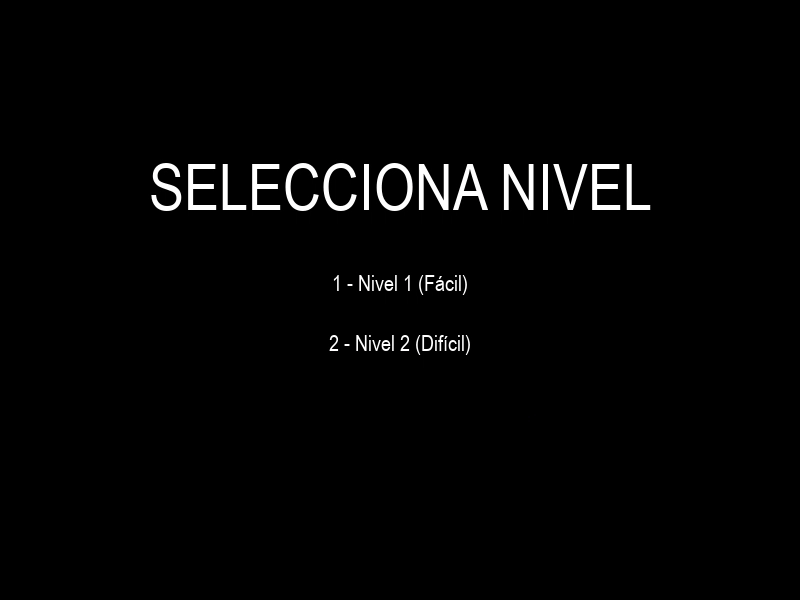

# Tank 2025 Remake



Este es un juego de tanques inspirado en el clásico *Battle City (Tank 1990)* de la consola NES, desarrollado utilizando *PyGame* como parte de la prueba **ESP_Python. A Practical Assignment for the Tutor** de *Kodland*.

## 🎮 Descripción

En este juego, controlas un tanque que debe defender su base mientras elimina a los tanques enemigos. El juego cuenta con:

- 🪖 Tanques con movimiento en cuatro direcciones
- 💥 Sistema de disparos
- 🧱 Dos tipos de bloques: destructibles (ladrillo) e indestructibles (acero)
- 🤖 Enemigos con IA simple
- 🔥 Dos niveles de dificultad:
  - **Nivel 1**: Pocos enemigos
  - **Nivel 2**: 8 enemigos
- ❤️ Sistema de vidas para el jugador

## 🛠️ Funcionalidades

### 🏠 Menús
- Pantalla de inicio
- Selección de nivel (dos niveles disponibles)
- Pantalla de *Game Over* / Victoria

### ⚔️ Mecánicas de juego
- Control del tanque del jugador con las flechas del teclado
- Disparo con la tecla Espacio
- Colisiones entre tanques, balas y bloques
- Sistema de daño y destrucción
- HUD que muestra vidas, enemigos restantes y nivel actual

### 🤖 Enemigos
- Tanques enemigos con movimiento aleatorio
- IA simple que dispara periódicamente
- Enemigos disparan al detectar al jugador en su línea de tiro
- Diferente cantidad de enemigos según el nivel

## 📜 Requisitos

- Python 3.x
- PyGame

## 🚀 Instalación

1. Asegúrate de tener Python instalado
2. Instala PyGame con el siguiente comando:
   ```bash
   pip install pygame
   ```
3. Ejecuta el archivo principal:
   ```bash
   python tank_game.py
   ```

## 🎮 Controles

- **⬆️⬇️⬅️➡️** - Mover el tanque
- **Espacio** - Disparar
- **ESC** - Salir del juego (durante la partida)
- **R** - Reiniciar (tras *Game Over*)
- **Q** - Salir (tras *Game Over*)

## 📁 Estructura del proyecto

El juego está organizado en varias clases:
- `Tanque` - Controla tanto al jugador como a los enemigos
- `Bala` - Gestiona los proyectiles
- `Bloque` - Representa los obstáculos del mapa
- `Base` - La base que el jugador debe defender

También contiene funciones para gestionar los menús, crear niveles y mostrar información en pantalla.

## 🎵 Créditos

Desarrollado por **Jhony Michael Durán Ramírez** como parte de la prueba **ESP_Python. A Practical Assignment for the Tutor** de *Kodland*.

Inspirado en el clásico *Battle City (Tank 1990)* de *Namco*.

Sonidos tomados de [Pixabay](https://pixabay.com/es/sound-effects/):
- 🎵 *Gano*: `you-win-sequence-3-183950.mp3`
- 🎵 *Perdió*: `gameover-86548.mp3`
- 🎵 *Tanque en movimiento*: `tank-moving-143104.mp3`
- 🎵 *Intro*: `0-top-battle-game-bgm-264625.mp3`

📚 **Librería utilizada y documentación**: [PyGame](https://www.pygame.org/docs/)

